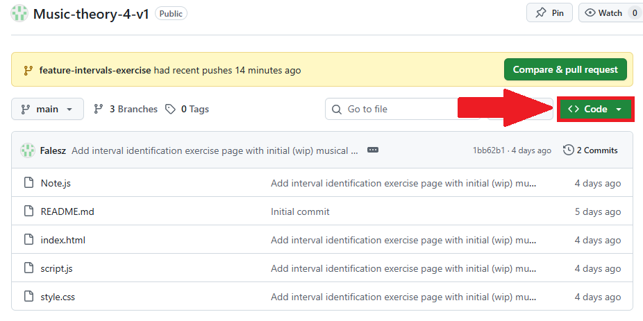
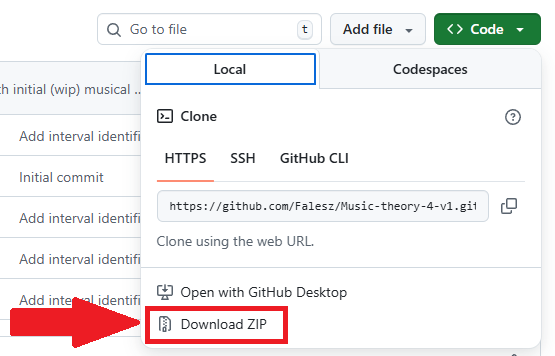
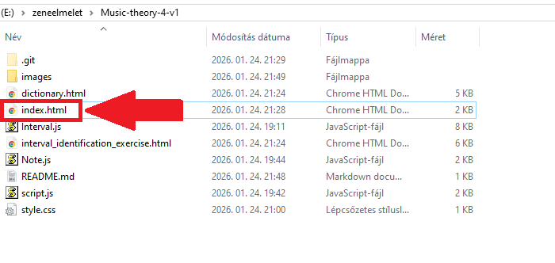

#  Felhasználói dokumentáció

## A program készítése

A program 64 bites Google Chrome (verzió: 143.0.7499.193) böngésző, Visual Studio Code szövegszerkesztő és Windows 10 segítségével készült.

## A program beüzemelése

A program egy egyszerű weboldal, ami teljes egészében a böngészőben fut lokálisan; nem szükséges webszerver beüzemelése a program használatához.

A program fájlai a GitHub repóból a "Code" gombra nyomva érhetőek el `zip` formátumba tömörítve:
  
A "Code" gombra kattintás után:  
  

A `zip` tömörített állomány a számítógépen tetszőleges helyre való kicsomagolása után az `index.html` állományra való dupla kattintással lehet
a programot indítani. Ekkor az alapértelmezett böngészőben megjelenik a weboldal és el lehet kezdeni az oldalon navigálni.  
 

## A program használata

Minden lap jobb oldalán található egy navigációs felület, amely tartalmazza a weboldal különböző lapjaihoz vezető linkeket. Ezekre kattintva navigálható az oldal.  

A lapok bal oldalán található a tartalom. Itt lehet feladatokat megoldani és a lapok tartalmait böngészni. A főoldalon és a feladatok lapjain kívül az oldal 
tartalmaz egy szótárat, ami a gyakran nehezen követhető angol és magyar megfelelőit tartalmazza a zeneelméleti kifejezéseinknek.

#  Fejlesztői dokumentáció

## A programról

A program tiszta HTML, CSS és JavaScript nyelveken készült, így nem szükséges webszerver a használathoz, csak egy modern böngésző, pl. Google Chrome.

## Ismert hibák
- Előfordulhat, hogy a hangköz azonosító feladattípus olyan hangközt generál, amire nem szerepel megoldás a bemeneti mezők között, pl. `Cbb - C` hangközt.
- A program vélhetően gyakrabban generál alacsonyabb véletlen számokat, az eloszlásuk nem egyenletes, ez befolyásolja a véletlenszerűen generált hangokat, hangközöket

## Fejlesztési lehetőségek
- További feladattípusok implementálása, pl. hármashangzatok azonosítása, hangközök azonosítása hallás alapján hangfájlok lejátszásával, stb.
- Felhasználói élmény megteremtése egy értékelhető látványtervvel